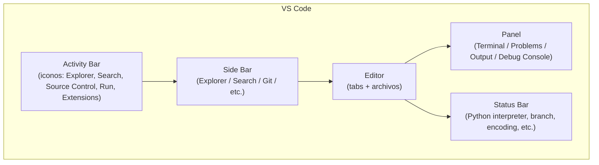

# VS Code: instalación, layout y shortcuts

Esta sección es 80% “aprender dónde está cada cosa” y 20% “aprender los atajos que te vuelven 10× más rápido”.

## Instalación (sin perderte)

### Linux

- Instala VS Code desde tu método preferido (paquete oficial, repositorio de tu distro, o Snap/Flatpak).
- Asegúrate de poder ejecutar `code` desde tu terminal (opcional pero útil).

### macOS

- Descarga la app y, si quieres, habilita el comando `code` en PATH desde:
  - Command Palette → “Shell Command: Install 'code' command in PATH”

### Windows (con WSL2)

La forma “correcta” para este curso es:

- Instalar VS Code en **Windows**
- Instalar la extensión **Remote - WSL**
- Abrir tu proyecto **dentro de WSL**

Porque tu terminal del curso es Unix (Linux/WSL2) y ahí van a vivir Python, uv, git y docker (según tu setup).

---

## Anatomía de VS Code (qué es cada parte)

VS Code tiene una estructura muy consistente:



### Piezas que debes ubicar hoy

- **Explorer**: tu proyecto (carpetas/archivos)
- **Editor + Tabs**: donde editas
- **Terminal integrada**: donde ejecutas comandos del curso
- **Problems**: errores/warnings detectados por herramientas (Python, linters, etc.)
- **Status Bar**: pistas críticas (por ejemplo: qué Python estás usando)

---

## Shortcuts esenciales (si solo memorizas 10, que sean estos)

> En VS Code, la clave es aprender a navegar sin mouse. Los atajos varían por SO; aquí van los más universales.

| Acción | Windows / Linux | macOS | Para qué sirve |
|-------|------------------|-------|----------------|
| Command Palette | `Ctrl+Shift+P` | `Cmd+Shift+P` | “hacer todo” sin buscar menús |
| Quick Open | `Ctrl+P` | `Cmd+P` | abrir archivos por nombre |
| Buscar en archivo | `Ctrl+F` | `Cmd+F` | encontrar texto en el archivo actual |
| Buscar en proyecto | `Ctrl+Shift+F` | `Cmd+Shift+F` | buscar en toda la carpeta |
| Reemplazar | `Ctrl+H` | `Cmd+Option+F` | reemplazo (cuidado) |
| Toggle Terminal | `` Ctrl+` `` | `` Cmd+` `` | abrir/cerrar terminal integrada |
| Split editor | `Ctrl+\` | `Cmd+\` | ver 2 archivos lado a lado |
| Ir a línea | `Ctrl+G` | `Cmd+G` | saltar a una línea |
| Comentar línea | `Ctrl+/` | `Cmd+/` | comentar/descomentar rápido |
| Formatear documento | `Shift+Alt+F` | `Shift+Option+F` | aplicar formatter (cuando esté configurado) |

### Dos shortcuts “secretos” que valen oro

- **Mostrar atajos**: busca “Keyboard Shortcuts” en Command Palette.
- **Buscar cualquier cosa**: Command Palette + escribir (archivos, settings, acciones, extensiones).

---

## La terminal integrada (y por qué importa)

La terminal integrada no es un “extra”: es la forma más común de ejecutar:

- `python ...`
- `uv ...`
- `git ...`
- `docker ...`

En la práctica, trabajas así:

1. Editas en el editor
2. Ejecutas en la terminal
3. Lees el error
4. Regresas al editor y arreglas

Si la terminal todavía te confunde, apóyate en el [Módulo 4: La Terminal](../04_terminal/00_index.md).

---

## Post-instalación (5 ajustes que te evitan dolor)

1. **Activa Settings Sync** (opcional): te sincroniza settings/extensiones entre máquinas.
2. **Ajusta tipografía**: Settings → “Font Size” (editor) y “Terminal Font Size”.
3. **Elige theme**: Settings → “Color Theme” (un theme consistente ayuda a leer más).
4. **Activa Auto Save** (si te gusta): “Files: Auto Save” → `afterDelay`.
5. **Aprende a abrir carpetas**: siempre trabaja abriendo la carpeta del proyecto (no un archivo suelto).

---

::::exercise{title="Instalación verificada + navegación básica" difficulty="1"}

1. Abre VS Code.
2. Abre una carpeta de trabajo (cualquiera).
3. Abre la terminal integrada y ejecuta:

```bash
pwd
ls
python3 --version
```

4. Usa `Ctrl+P` / `Cmd+P` para abrir un archivo por nombre.
5. Usa `Ctrl+Shift+F` / `Cmd+Shift+F` para buscar una palabra en todo el proyecto.

Si `python3 --version` falla, tu problema no es VS Code: es tu instalación de Python/PATH. Regresa al [Módulo 9: Python](../09_python/00_index.md).

::::

