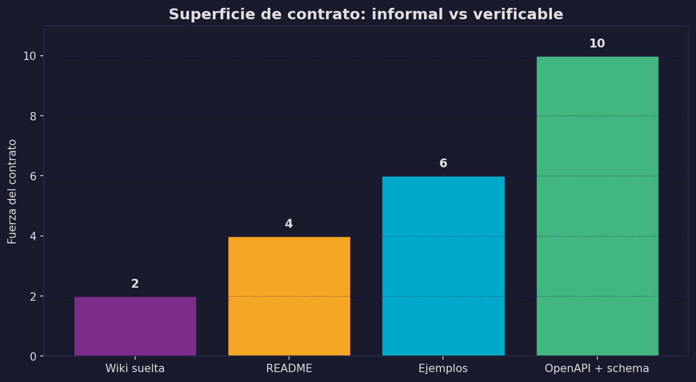
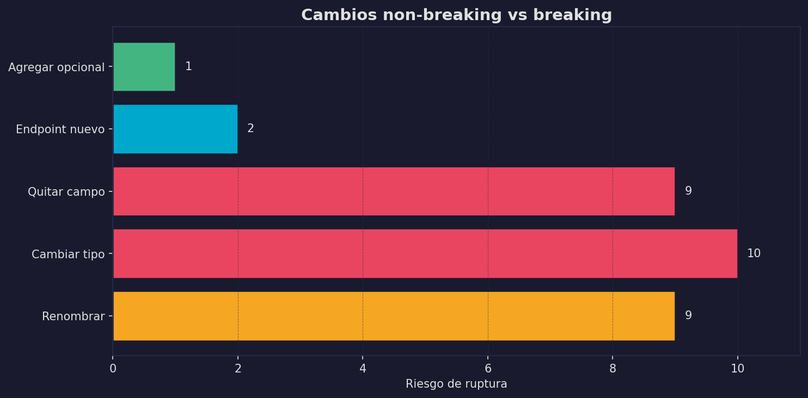
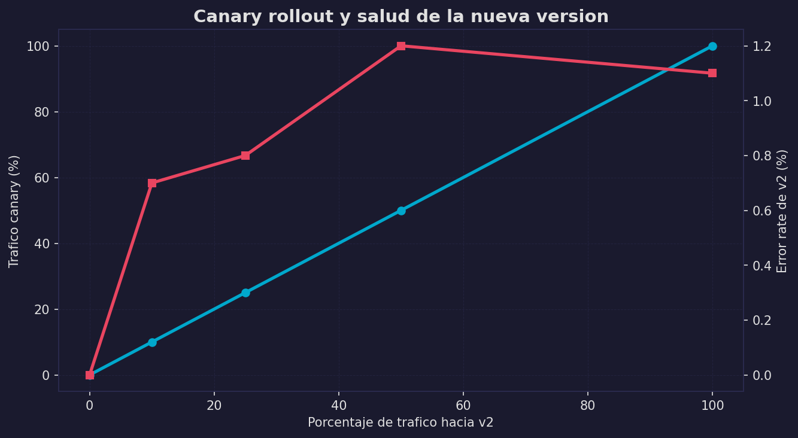
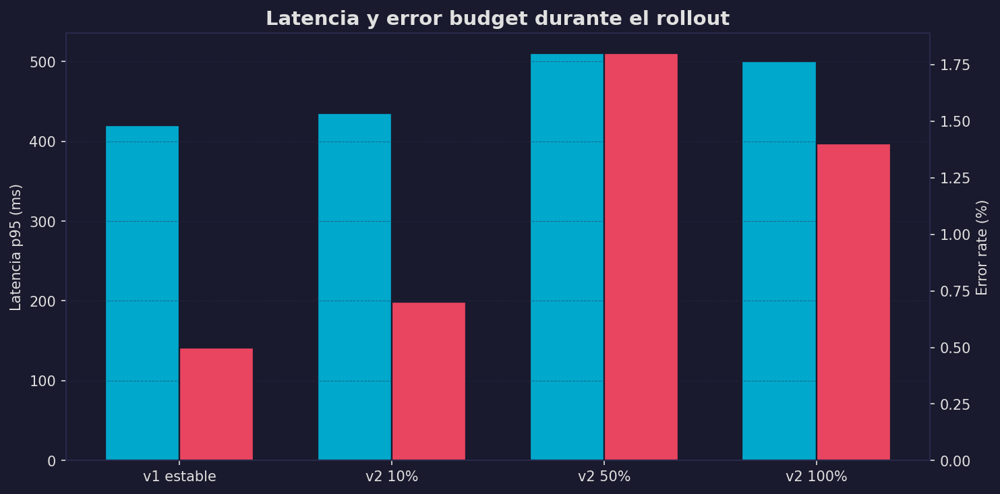

# Síntesis y árbol de decisión

En la sección 18 la síntesis final comparaba **protocolos**.

En la sección 19 la síntesis compara **presiones de diseño**. La pregunta ya no es solo “qué protocolo usar”, sino:

**¿qué necesita esta API para ser durable en el tiempo?**

---

## Tabla maestra de decisiones

```
+--------------------------+-----------------------------+----------------------------------+
| Presion                  | Herramienta principal       | Pregunta clave                   |
+--------------------------+-----------------------------+----------------------------------+
| Ambiguedad del contrato  | OpenAPI / schemas          | Que exactamente prometes?        |
+--------------------------+-----------------------------+----------------------------------+
| Shape fragil             | Buen modelado               | Puede crecer sin romper?         |
+--------------------------+-----------------------------+----------------------------------+
| Cambio frecuente         | Versionado / deprecacion    | Como evolucionas?                |
+--------------------------+-----------------------------+----------------------------------+
| Drift entre equipos      | Contract testing            | El producer sigue cumpliendo?    |
+--------------------------+-----------------------------+----------------------------------+
| Trafico externo          | Gateway / edge policies     | Quien entra y cuanto pide?       |
+--------------------------+-----------------------------+----------------------------------+
| Releases riesgosas       | Canary / observabilidad     | Como detectas daño temprano?     |
+--------------------------+-----------------------------+----------------------------------+
| Riesgo y abuso           | Threat modeling + authz     | Que puede salir mal?             |
+--------------------------+-----------------------------+----------------------------------+
```

---

## Árbol de decisión

```
Que problema tienes?
|
+-- Los consumidores no entienden bien la API?
|   |
|   +---> Escribe el contrato en OpenAPI
|         y agrega ejemplos + errores + schemas
|
+-- La API funciona hoy pero es fragil al cambio?
|   |
|   +---> Revisa modelado de requests/responses
|         y clasifica cambios breaking vs aditivos
|
+-- Tienes miedo de romper clientes al desplegar?
|   |
|   +---> Agrega contract tests
|         y una estrategia de rollout con metricas
|
+-- Tu API ya es publica o recibe trafico hostil?
|   |
|   +---> Usa controles de borde:
|         auth inicial, rate limit, routing, logs
|
+-- Tu API toca datos sensibles o acciones costosas?
    |
    +---> Haz threat modeling
          y separa autenticacion de autorizacion
```

---

## Cuatro figuras que resumen el módulo

Las gráficas del módulo resumen cuatro ideas:

1. **`contract_surface.png`**
   cuánto valor da un contrato explícito frente a documentación informal

2. **`breaking_vs_nonbreaking.png`**
   comparación visual de cambios seguros vs peligrosos

3. **`canary_rollout.png`**
   porcentaje de tráfico y salud de la nueva versión

4. **`latency_error_budget.png`**
   tradeoff entre latencia, errores y confianza operativa



Lectura: mientras más formal y verificable es el contrato, menos dependes de memoria, acuerdos verbales o documentación que se desactualiza.



Lectura: no todos los cambios cuestan lo mismo; una API madura intenta empujar la mayoría de sus cambios hacia el lado aditivo.



Lectura: un rollout sano no mira solo "cuánto tráfico ya pasé", sino si la nueva versión sigue estable mientras ese porcentaje crece.



Lectura: si la latencia y la tasa de error empiezan a consumir demasiado error budget, el mensaje no es "espera a ver si mejora", sino "detén o revierte".

---

## La arquitectura del chatbot, ahora bien diseñada

```
Usuario
  │
  ▼
Gateway
  │  - auth inicial
  │  - rate limit
  │  - request id
  ▼
API del chatbot
  │  - OpenAPI
  │  - validacion
  │  - modelado durable
  │  - versionado
  │  - contract tests
  ▼
servicios internos / modelo
  │
  └─ observabilidad + releases seguros
```

Observa cómo cambió la mentalidad:

- sección 18: elegir flechas
- sección 19: gobernar contratos, cambios y operación

---

## Regla final

**Empieza por el contrato, protege con pruebas, controla el borde, libera con señales.**

Esa secuencia resume el módulo entero.

---

> **Verifica en el notebook:** Revisa `clase/19_diseno_api/code/05_benchmarks_y_graficas.ipynb` para reproducir las gráficas del capítulo y conectar cada una con una decisión de diseño concreta.

---

:::exercise{title="Diseña la estrategia completa para una API nueva"}
Vas a lanzar una API pública para un chatbot universitario.

Define en una página:

1. contrato inicial
2. shape de request/response
3. política de versionado
4. pruebas mínimas
5. controles de gateway
6. métricas para rollout
7. principal riesgo de seguridad

Después resume tu diseño en una sola frase con este formato:

“Esta API será durable porque...”
:::
